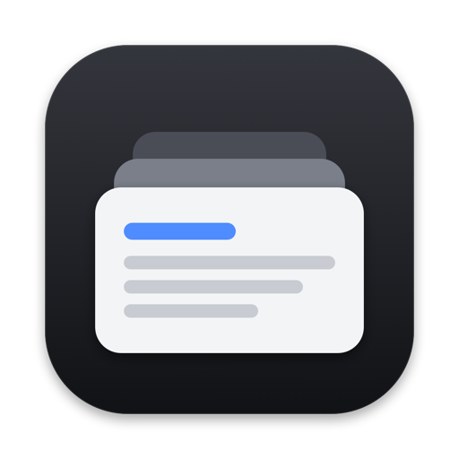
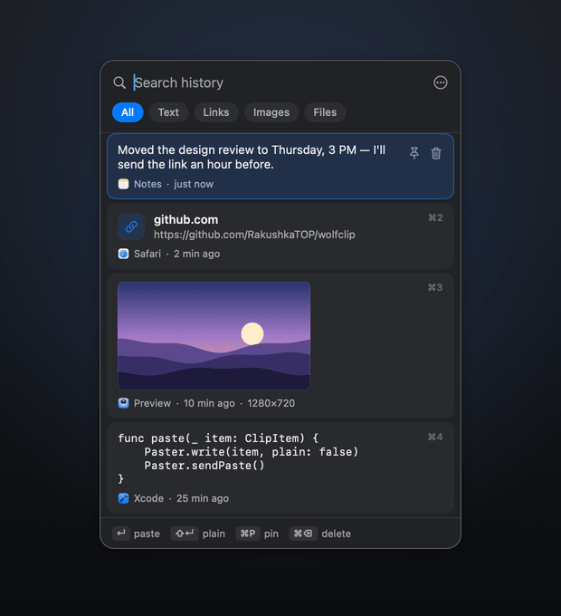
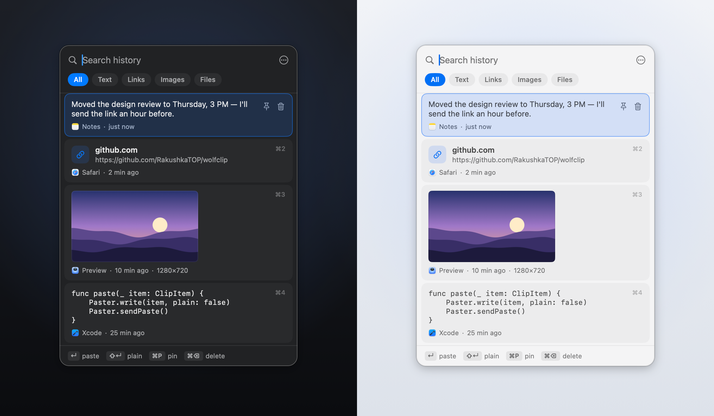
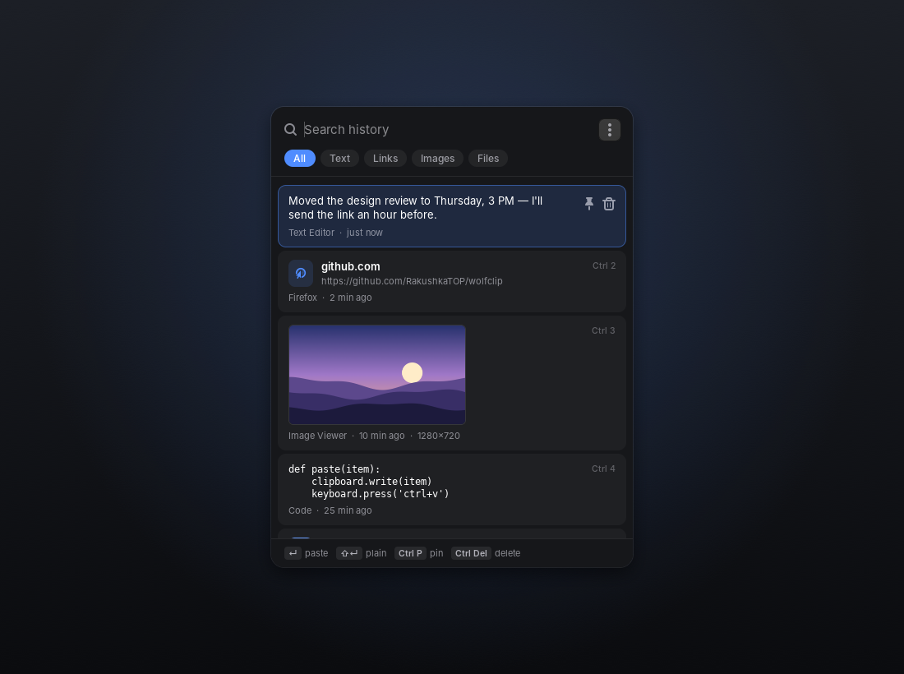

<div align="center">



# WolfClip

**Clipboard history for macOS and Linux — the Win+V you were missing.**

Press one shortcut in any app, pick anything you copied earlier, and it lands right where you type.

[](https://github.com/RakushkaTOP/wolfclip/releases/latest)


[](LICENSE)

English · [Русский](README.ru.md)

<br>



</div>

<br>

## Why WolfClip

- **Instant paste.** Choose an item and WolfClip pastes it into the app you were in. No extra keystrokes.
- **Everything you copy.** Text, links, colors, code, images and files, each shown the way it reads best. A swatch for `#4F8CFF`, a thumbnail for a screenshot, a monospace block for code.
- **Find it in a second.** Start typing to search, `Tab` through filters, or press `⌘1`–`⌘9` to paste one of the first nine items.
- **Pins that stay.** Keep addresses, snippets and templates at the top. Pinned items never expire.
- **Keyboard first, mouse friendly.** Arrows, Enter, Escape, plus click, hover actions and a context menu.
- **Private by design.** Passwords copied from password managers are never recorded. History stays on your computer.
- **Native and light.** Swift and SwiftUI on macOS, GTK 4 on Linux. No Electron, near-zero CPU while idle.
- **Dark, light or system.** Speaks English and Russian, picked from your system language.

<br>

<p align="center">
  
</p>

<br>

## Install

### macOS

1. Download **WolfClip-macOS.zip** from the [latest release](https://github.com/RakushkaTOP/wolfclip/releases/latest) and drag **WolfClip** into **Applications**.
2. Open it. The app is not notarized by Apple, so the first time macOS asks you to confirm. Open **System Settings → Privacy & Security** and click **Open Anyway**, or run:
   ```bash
   xattr -dr com.apple.quarantine /Applications/WolfClip.app
   ```
3. Allow **Accessibility** when WolfClip asks. It needs this to press `⌘V` for you and to open next to the text cursor. Without it, picks are only copied.

WolfClip lives in the menu bar and starts at login. Press **⇧⌘V** anywhere.

<details>
<summary>Build from source</summary>

Only the Xcode Command Line Tools are needed:

```bash
git clone https://github.com/RakushkaTOP/wolfclip.git
cd wolfclip/macos
./build.sh install          # arm64; UNIVERSAL=1 ./build.sh install for Intel + Apple silicon
```

</details>

### Linux

```bash
curl -L https://github.com/RakushkaTOP/wolfclip/releases/latest/download/wolfclip-linux.tar.gz | tar xz
cd wolfclip-linux && ./install.sh
```

The installer checks for Python 3 with GTK 4. If they are missing, it offers to install them with `apt`, `dnf`, `pacman` or `zypper`. Everything else goes into your home folder. To remove WolfClip, run `./uninstall.sh` (add `--purge` to delete the history too).

Press **Super+V** in any app.

<p align="center">
  
</p>

| Session | Shortcut | Auto-paste | Opens at |
|---|---|---|---|
| **X11** | Built in (Super+V, configurable) | Built in | Mouse pointer |
| **Wayland** (beta) | Bind `wolfclip --toggle` in system settings (Settings has a button for GNOME) | With [`wtype`](https://github.com/atx/wtype) or [`ydotool`](https://github.com/ReimuNotMoe/ydotool) | Placed by the compositor |

X11 is the tested setup. On Wayland, WolfClip runs through XWayland to follow the clipboard, and how well that works depends on the compositor. Reports are welcome.

<br>

## Shortcuts

| | macOS | Linux |
|---|---|---|
| Open history | `⇧⌘V` | `Super+V` |
| Move | `↑` `↓` | `↑` `↓` |
| Paste | `↵` or click | `Enter` or click |
| Paste as plain text | `⇧↵` | `Shift+Enter` |
| Paste item 1–9 | `⌘1`–`⌘9` | `Ctrl+1`–`Ctrl+9` |
| Copy without pasting | `⌘C` | `Ctrl+C` |
| Pin / unpin | `⌘P` | `Ctrl+P` |
| Delete | `⌘⌫` | `Ctrl+Delete` |
| Next / previous filter | `Tab` / `⇧Tab` | `Tab` / `Shift+Tab` |
| Clear search, close | `Esc` | `Esc` |

The shortcut can be changed in Settings. On macOS, `⇧⌘V` replaces "Paste and Match Style" in the apps that use it. Pick `⌥⌘V` or another option if you rely on it.

<br>

## Privacy

- Items that password managers mark as secret are skipped: the `org.nspasteboard` concealed and transient markers on macOS, the KDE password-manager hint on Linux.
- History is a local file: `~/Library/Application Support/WolfClip` on macOS, `~/.local/share/wolfclip` on Linux. Nothing is sent anywhere.
- You can pause recording at any time from the menu.

<br>

## How it works

<details>
<summary>For the curious</summary>

**macOS.** A menu-bar app in Swift and SwiftUI. It checks the pasteboard change counter a few times per second, which is effectively free. The global shortcut is a Carbon hot key, so it needs no permissions. The history is a non-activating panel: it takes the keyboard without stealing focus from your app, so the paste goes right back where you were. Paste is a synthetic `⌘V`. The window is placed at the text caret through the Accessibility API, with the mouse pointer as a fallback.

**Linux.** Python 3 with GTK 4, no extra Python packages. The clipboard comes from GTK's change notifications. The hot key, focus handling and auto-paste talk to X11 directly (`XGrabKey`, EWMH, XTest) through `ctypes`. Terminals get `Ctrl+Shift+V` automatically. A Docker harness in [`linux/test`](linux/test) runs the app headless on Xvfb for testing.

</details>

<br>

## License

[Apache 2.0](LICENSE) © RakushkaTOP. Use it, change it, ship it, even commercially. When you redistribute it, keep the copyright, the license and the [NOTICE](NOTICE) file that credits the author, and mark what you changed.
